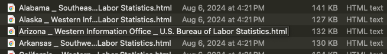
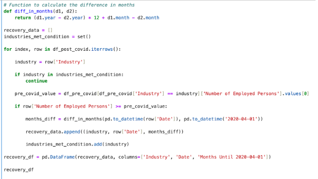
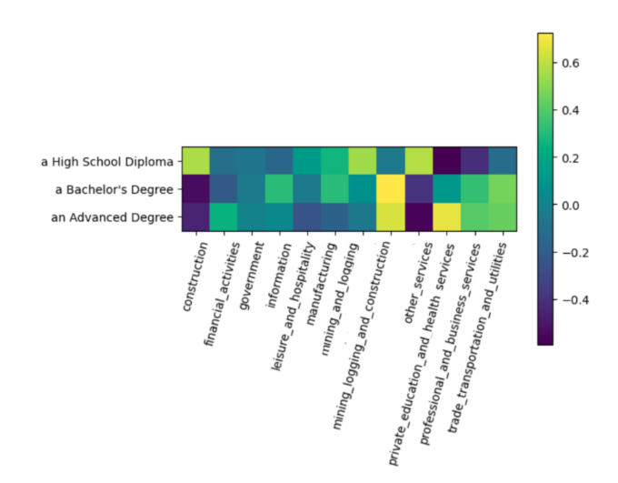

# capstone_us_employment_trends

# Motivation:
The COVID-19 pandemic has profoundly impacted lives and the global economy, leading to substantial shifts in the labor market and widespread unemployment.

This project primarily aims to provide a comprehensive understanding of the changes in employment in the US after COVID-19, thereby aiding informed decision-making and targeted policy development. The findings from this analysis could potentially influence policy-making, helping the US government and organizations respond more effectively to future economic crises.

On a personal level, I have been affected by the economic downturn due to the COVID-19 pandemic and the resulting job cuts. This analysis is particularly meaningful to me as I seek to understand job opportunity trends following the pandemic, both to target the market effectively for myself and to create a tool that can be useful for other impacted job seekers.

# Data Questions:
How has employment changed in the US after COVID-19? The analysis is structured around the following questions:

a. Which state has been most/least affected, and which one is fastest in bouncing back?
Methodology: The 'bounce back time' (bbt) variable was calculated to measure how quickly states recovered to pre-pandemic unemployment levels.

b. Does industry have an impact on state-level employment performance?
Methodology: Analyzed using the "Depth of Impact" metric by industry and state to observe the variation in employee numbers.

c. Which industry has been the most/least affected, and which one is fastest in bouncing back?
Methodology: Investigated by comparing "Depth of Impact" and 'recovery time' across different industries.

d. What are the underlying factors for these trends specifically, exploring education levels by state?
Methodology: Explored through the distribution of educational attainment and unemployment rates by state.

e. What is the correlation between these underlying factors (e.g., the interplay between education and industry)?
Methodology: Examined using a correlation matrix comparing industry employment data and educational attainment percentages.

# Tools and Technologies
To conduct this analysis, I worked with approximately 650 files that were either downloaded or scraped from various sources.

Python:
- Performed web scraping.
- Cleaned, joined, and transformed data from various sources.
- Conducted exploratory analysis.
- Analyzed impact using transformation variables created with functions and loops.

Tableau:
- Used for data visualization through interactive dashboards.

Visual Studio Code:
- Used for editing HTML/Markdown files.

# Data Sources:
- U.S. Bureau of Labor Statistics (BLS): https://www.bls.gov/
- Wikipedia/Census: https://en.wikipedia.org/wiki/List_of_U.S._states_and_territories_by_educational_attainment

# Challenges Faced:
1. Getting the Data: Downloading and Scraping

Initially, I downloaded state-wise unemployment rates from the BLS website. Following that, I aimed to gather industry-wise employment data for each state. Given that each state has 11-12 industries, this task required manually downloading over 550 files.

After attempting this for 20 states, I realized the process was extremely tedious and error-prone. To overcome this, I decided to automate the process by web scraping all 550+ files. However, the BLS website has protective measures in place to prevent automated scraping, which made direct scraping challenging.

To work around this, I first downloaded HTML files for each state (51 HTML files in total), where each page listed the industries and their corresponding URLs.

I then wrote a script to automate the extraction and processing of the data. I identified patterns in the industry URLs in each state file. Using BeautifulSoup, the script read each HTML file. It searched for relevant tags, filtering them to include only those containing specific words in the URL. It then constructed the full URLs where necessary, removed duplicates, and kept only the relevant links.

Next, the script created a state-specific folder (based on the HTML filename) in the output directory. Each industry URL was then processed by a function I wrote called process_url, which scraped the relevant data, converted it into a DataFrame, and saved it as a CSV file. This process ensured that the data was organized efficiently, with a separate CSV file for each combination of state and industry.

2. Data Accuracy: Ensuring that the data collected was accurate and consistent across different states required thorough validation checks.

Input files:

Output files:

Recovery time code:

# Analysis Variables:

Python:
To understand which state and industry was the fastest or slowest in bouncing back, I created a variable in Python called ‘bbt’ (bounce back time). I used loops and functions to calculate ‘bbt’ for every state as the number of months it took from April 2020 to reach pre-pandemic unemployment rates. Similarly, I calculated 'recovery time' for every industry.

Tableau:
To gauge the most/least affected states, I created a calculated field in Tableau called "Depth of Impact," which is determined by the percentage difference in the number of employees in a given time period for each state. This can be filtered by industry to show the per state, per industry difference in employee numbers.

I also calculated cumulative industry-wise "Depth of Impact" to determine the most/least affected industries.

Python:
To gain granular insights on the relationship between employment and education, I created a correlation matrix. Each matrix cell represents the correlation coefficient between the number of employees in each state for a specific industry (columns) and the percentage of educational attainment in each corresponding state for a specific education level (rows).

# Insights Gained

a. Which state has been most affected, and which one is fastest in bouncing back? 
- Nevada, New York, and New Jersey are the most affected in terms of employee volume.
- Massachusetts, South Carolina, and Oregon have the longest bounce back time to their pre-COVID unemployment levels.
- Puerto Rico, Nebraska, and Montana have the shortest bounce back time, although employee volumes are low in these states.

b. Does industry have an influence on the state-level employment performance?
Yes, "Depth of Impact" (percentage difference in employee numbers from pre-COVID to during COVID) significantly varies by industry for every state.

- Nevada is the hardest hit on this metric, with 'Leisure and Hospitality' as its most dominant industry. This industry also experienced the biggest dip in employment during COVID.
- High-impact states like New York and New Jersey have 'Private Education and Health' and 'government' as a dominant industry.

c. Which industry has been the most/least affected, and which one is fastest in bouncing back? 
- 'Leisure and Hospitality,' 'Mining and Logging,' and 'Other Services' had the highest "Depth of Impact."
- 'Leisure and Hospitality,' 'Government,' and 'Other Services' took the longest time to recover to their pre-COVID unemployment levels.
- 'Financial Activities' has been the least affected, both in terms of "Depth of Impact" and recovery time. 'Information' had a low recovery time.
- Interestingly, the 'Government' sector had a lower "Depth of Impact" but one of the highest recovery times, indicating that its resilience is low and that measures to improve its recovery could be beneficial.

d. Other underlying factors for these trends- exploring education levels by State
- On exploring the distribution of educational attainment percentages by high school, bachelor's, and master's levels by state, and the distribution of unemployment rates by state, an ambiguous relationship was observed.
- Some states like Nevada show a direct relationship between education % and unemployment rates, while others like South and North Dakota show an inverse relationship.

e. Correlation between the underlying factors (here we explore education and industry’s interplay)
To gain deeper insights into the relationship between employment and education, I created a correlation matrix where each cell represents the correlation coefficient between the number of employees in a specific industry and the percentage of educational attainment for a given state.

High correlations were found between:

'Other Services' and 'High School Diploma'
'Private Education and Health' and 'Advanced Degree'
From previous analysis, we know that 'Other Services' is one of the most affected industries in terms of both recovery time and "Depth of Impact." 

# Key Recommendations 

a. Invest in Digital Adaptability:
Strengthen digital infrastructure across industries to support remote work and operations, ensuring sectors like Leisure and Hospitality can recover faster in future disruptions, modeling the stability of sectors like IT and Finance.

b. Targeted Regional Support:
Implement region-specific recovery strategies that provide tailored support to the most affected industries, such as Nevada's Leisure and Hospitality sector, through financial aid and workforce development.

c. Prolonged Assistance for Vulnerable Sectors:
Provide extended support to industries like ‘Leisure and Hospitality’ and ‘Other Services’ during crises, while offering short-term stabilization for other sectors.

d. Enhance Government and Private Health and Education Sectors’ Resilience:
Improve resilience with better crisis management, expanded remote work capabilities, and cross-training of employees.

e. Upskill and Educate for Future Resilience:
To improve economic resilience, focus on upskilling people and expanding their access to higher education in states where industries like 'Other Services' are dominant, as this industry is highly correlated with lower education levels.

# Next Steps
- Study other underlying factors: Analyze the impact of COVID-19 cases, vaccination data, and demographics to gain further insights into the employment trends observed.
- Make the dashboard more customized for impacted job seekers to target the market effectively by identifying the best states and industries. Currently, changes in the number of employees by state and time act as a proxy. I would like to add the same for job openings and the number of establishments data in the future.

